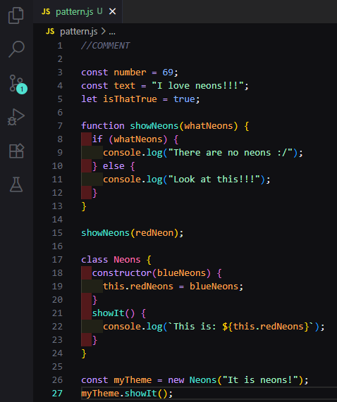

# Slate Neon for VS Code

Slate Neon is a dark, minimalist theme with soft neon accents. Subtle colors for functions, classes, and variables make your code easy to read and gentle on the eyes.

## Screenshots

## Install from repository
1. Clone this repo
2. Copy the folder into your VS Code extensions directory:
   - Windows: `%USERPROFILE%\.vscode\extensions`
   - Linux/macOS: `~/.vscode/extensions`
3. Restart VS Code
4. Open Command Palette → `Preferences: Color Theme` → select **Slate Neon**

## Install from Marketplace
Search for "Slate Neon" in the Extensions panel or install directly: [Slate Neon on Marketplace](https://marketplace.visualstudio.com/items?itemName=OskarSodel.slate-neon)

## Owner

 |
:---: |
[Oskar S.](https://github.com/k4rdel) |

## License
This project is licensed under the MIT License – see the [LICENSE](LICENSE) file for details.
